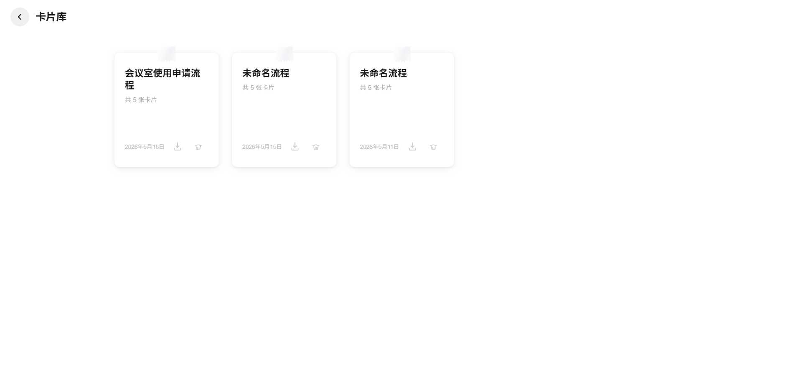

<a id="readme-top"></a>

<!-- 徽章置顶 -->
<div align="center">


</div>

<!-- Banner -->


<div align="center">
  <p>
    把冗长的流程文档拆解成卡片，每张卡片只讲一件事<br/>
    由业务人员主导 · AI 协作开发 · 零代码基础完成
  </p>
  <p>
    <a href="https://flow-card.vercel.app"><strong>🌐 在线体验 Demo »</strong></a>
    &nbsp;·&nbsp;
    <a href="https://github.com/daidaimoon/FlowCard/issues">报告问题</a>
    &nbsp;·&nbsp;
    <a href="https://github.com/daidaimoon/FlowCard/issues">功能建议</a>
  </p>
</div>

<details>
  <summary>📋 目录</summary>
  <ol>
    <li><a href="#-项目背景">项目背景</a></li>
    <li><a href="#-功能预览">功能预览</a></li>
    <li><a href="#-核心功能">核心功能</a></li>
    <li><a href="#-技术栈">技术栈</a></li>
    <li><a href="#-快速开始">快速开始</a></li>
    <li><a href="#-使用-agent-助手">使用 Agent 助手</a></li>
    <li><a href="#-未来规划">未来规划</a></li>
    <li><a href="#-关于这个项目">关于这个项目</a></li>
  </ol>
</details>

---

## 📖 项目背景

在行政管理的日常工作中，我长期被一个问题困扰：

> **公司发的流程邮件动辄几百字，PDF 操作手册密密麻麻。**
> 员工往往看完就忘，供应商找不到收件人，流程文档根本发挥不了作用。

传统方式的痛点：

- 📄 流程文档冗长，员工不会及时保存邮件
- 🔍 PDF 手册密密麻麻，关键步骤难以定位
- 📤 供应商不在公司收件人群组，无法收到流程说明
- 📸 没有配图，纯文字描述不直观

**FlowCard** 就是为解决这些问题而生的——把冗长的流程文档拆解成一张张卡片，每张卡片只讲一件事，配上图示和关键提示，让新员工、供应商或访客在两分钟内看懂整个流程。

<p align="right">(<a href="#readme-top">↑ 返回顶部</a>)</p>

---

## 🖼️ 功能预览

**主页** — 新建流程或进入卡片库，简洁直接


**卡片编辑** — 三栏布局，左侧卡片列表 · 中间预览 · 右侧编辑，所见即所得


**Agent 助手** — 上传 Markdown 文档自动拆卡，接入 DeepSeek API 一键 AI 润色


**沉浸式阅读器** — 卡片逐张翻阅，支持配图标注与语音播报


**卡片库** — 所有流程集中管理，显示最后编辑日期，支持导出与删除



<p align="right">(<a href="#readme-top">↑ 返回顶部</a>)</p>

---

## ✨ 核心功能

| 功能 | 说明 |
|------|------|
| 📋&nbsp; **卡片式流程编辑** | 将流程拆分为独立卡片，每张包含标题、说明、配图与标注 |
| 🤖&nbsp; **Agent AI 润色** | 上传 MD 文档自动拆卡，DeepSeek API 纠错别字、优化表达，不改原有结构 |
| 👁&nbsp; **沉浸式阅读器** | 卡片逐张翻阅，进度显示，支持语音播报（桌面端） |
| 📤&nbsp; **导出独立 HTML** | 每个流程导出为单一 HTML 文件，任何人用浏览器直接打开 |
| 🖼️&nbsp; **配图与标注** | 每张卡片可上传配图，支持添加标注定位关键位置 |
| 🗂️&nbsp; **卡片库管理** | 所有流程集中管理，显示更新日期，含二次确认防误删 |

<p align="right">(<a href="#readme-top">↑ 返回顶部</a>)</p>

---

## 🛠️ 技术栈

本项目为**纯前端单文件应用**，零依赖，无需安装任何软件：

| 技术 | 用途 | 选择原因 |
|------|------|----------|
| **原生 HTML/CSS/JS** | 整体结构与交互 | 零依赖，任意浏览器直接打开 |
| **localStorage** | 流程数据持久化 | 轻量即时，无感知保存 |
| **DeepSeek API** | AI 润色文字 | 纠错别字、优化表达，保持原有结构 |
| **Vercel** | 部署托管 | 免费，与 GitHub 自动同步部署 |

**开发方式：AI 协作编程（Vibe Coding）**

> 业务人员主导需求与产品决策，AI 负责代码实现，历经多轮迭代，从零原型到可用产品。

<p align="right">(<a href="#readme-top">↑ 返回顶部</a>)</p>

---

## 🚀 快速开始

无需安装任何软件，直接访问在线版本：

**[https://flow-card.vercel.app](https://flow-card.vercel.app)**

或下载本地使用：

```
① 点击右上角绿色 Code 按钮 → Download ZIP → 解压
② 用 Chrome 或 Edge 浏览器直接打开 index.html
③ 点击「新建流程」开始创建第一个流程卡片
```

> 💡 数据自动保存在浏览器本地，下次打开自动恢复

<p align="right">(<a href="#readme-top">↑ 返回顶部</a>)</p>

---

## 🤖 使用 Agent 助手

Agent 助手支持从现有文档快速生成卡片，适合已有流程文档的场景：

**Markdown 书写格式：**

```markdown
# 流程名称

## 第一步：步骤标题

1. 操作说明一
2. 操作说明二

## 第二步：步骤标题

1. 操作说明一
2. 操作说明二
```

**使用步骤：**

```
① 按模板格式编写 Markdown 文档（可在 Agent 页面下载模板）
② 上传 .md 文件，系统自动按 ## 标题拆分为卡片
③ 填写 DeepSeek API 密钥，点击「AI 润色」优化文字表达
④ 在右侧预览确认效果，点击「保存」写入卡片库
```

> 💡 AI 润色只纠正错别字、优化语言表达，不改变卡片顺序和结构

<p align="right">(<a href="#readme-top">↑ 返回顶部</a>)</p>

---

## 🗺️ 未来规划

- [x] 卡片编辑与管理
- [x] Agent AI 润色（DeepSeek）
- [x] 沉浸式阅读器 + 语音播报
- [x] 导出独立 HTML
- [x] 卡片库管理（含防误删确认）
- [ ] 云端数据存储（用户系统）
- [ ] 分享链接（URL 编码，无需下载文件）
- [ ] 移动端自适应优化

<p align="right">(<a href="#readme-top">↑ 返回顶部</a>)</p>

---

## 🙋 关于这个项目

这是我的第二个 Vibe Coding 作品。

我在行政部门负责门禁管理，长期面对一个实际问题：流程说明发出去，员工看不懂、记不住，供应商根本收不到。与其抱怨，不如自己做一个工具解决它。

我没有编程背景，但我对这个业务场景足够熟悉。整个开发过程中，我负责定义需求、判断方向、推动迭代，AI 负责实现代码。从想法到上线，历经多轮打磨，最终做出了这个真正在工作中用得上的产品。

---


项目地址：[https://github.com/daidaimoon/FlowCard](https://github.com/daidaimoon/FlowCard)

<p align="right">(<a href="#readme-top">↑ 返回顶部</a>)</p>
