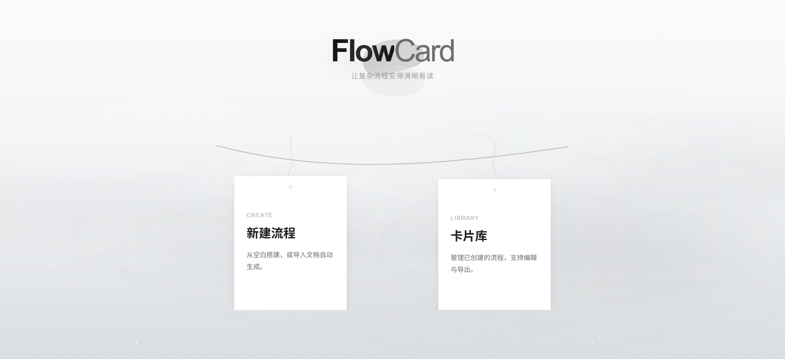
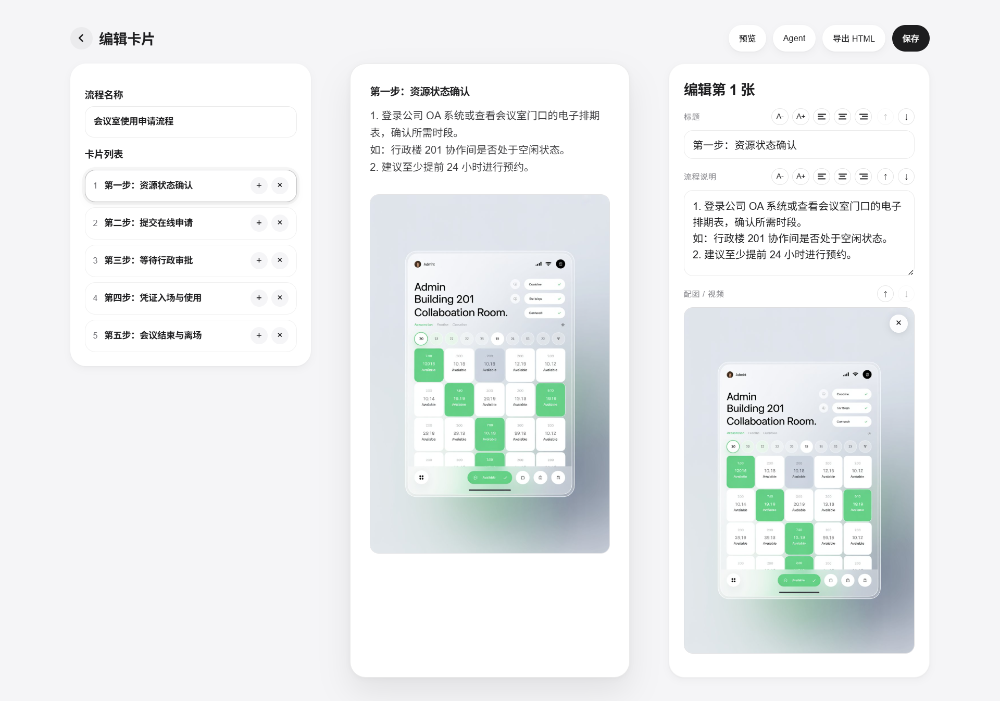
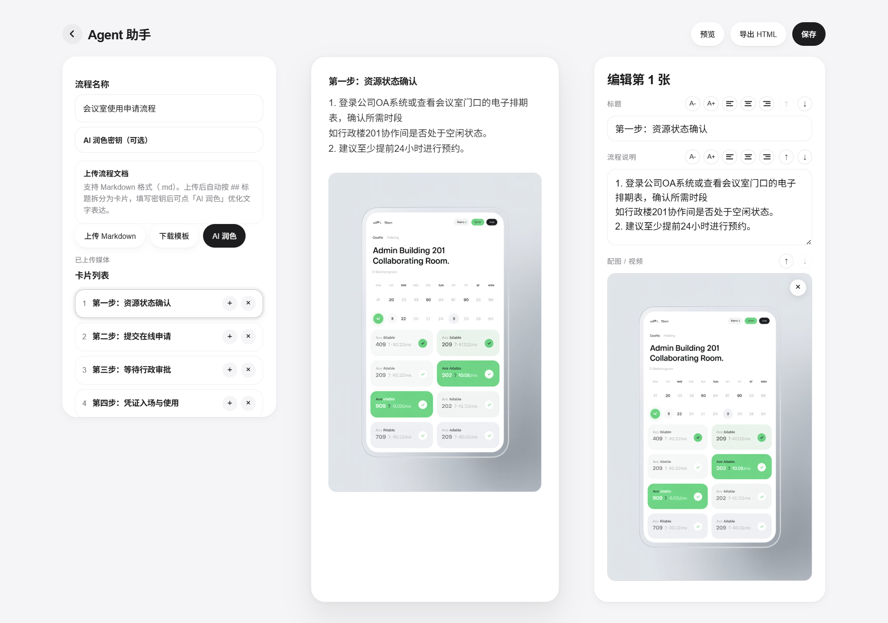
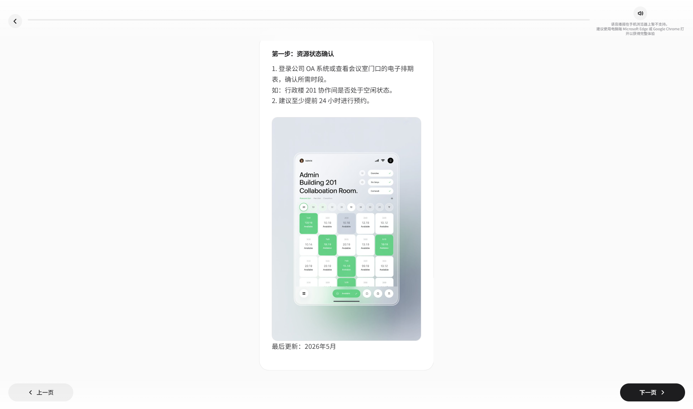

<div align="center">


<h1>FlowCard</h1>

<p>让复杂流程变得清晰易读</p>

<p>
  <a href="https://github.com/daidaimoon/FlowCard/stargazers">
    
  </a>
  <a href="https://github.com/daidaimoon/FlowCard/issues">
    
  </a>
  
  
</p>

<br />

**[查看 Demo](https://flow-card.vercel.app)** · **[报告问题](https://github.com/daidaimoon/FlowCard/issues)** · **[功能建议](https://github.com/daidaimoon/FlowCard/issues)**

</div>

---

## 项目背景

公司发的流程邮件动辄几百字，PDF 操作手册密密麻麻，员工往往看完就忘、找不到重点。

FlowCard 把冗长的流程文档拆解成一张张卡片，每张卡片只讲一件事，配上图示和关键提示，让新员工、供应商或访客在两分钟内就能看懂整个流程。

---

## 界面预览

| 主页 | 卡片编辑 |
|------|---------|
|  |  |

| Agent 助手 | 流程阅读 |
|-----------|---------|
|  |  |

---

## 核心功能

**卡片式流程编辑**
将流程拆分为独立卡片，每张卡片包含标题、说明文字、配图与标注，支持拖拽调整顺序。

**Agent 助手（AI 润色）**
上传 Markdown 文档，自动按 `##` 标题拆分为卡片。接入 DeepSeek API 后可一键润色文字——纠正错别字、优化语言表达，不改变原有结构和顺序。

**沉浸式阅读器**
卡片逐张翻阅，支持进度显示、语音播报（桌面端）、配图标注定位，适合在电脑或手机浏览器中分发。

**导出 HTML**
每个流程可导出为独立 HTML 文件，无需安装任何软件，发给任何人都能直接在浏览器中打开阅读。

**卡片库管理**
所有流程集中管理，显示最后编辑日期，支持导出与删除（含二次确认防误删）。

---

## 快速开始

FlowCard 是零依赖的纯前端单文件应用，无需安装，无需服务器。

```bash
# 直接下载 FlowCard.html，用浏览器打开即可使用
```

或访问在线版本：**[flow-card.vercel.app](https://flow-card.vercel.app)**

---

## 使用 Agent 助手

1. 按照模板格式编写 Markdown 文档（可在 Agent 页面下载模板）
2. 上传 `.md` 文件，系统自动按 `##` 标题拆分为卡片
3. 填写 DeepSeek API 密钥，点击「AI 润色」优化文字表达
4. 在右侧预览确认效果，点击「保存」写入卡片库

Markdown 书写格式：

```markdown
# 流程名称

## 第一步：步骤标题

1. 操作说明一
2. 操作说明二

## 第二步：步骤标题

1. 操作说明一
2. 操作说明二
```

---

## 技术栈

纯原生 HTML / CSS / JavaScript，单文件，零外部依赖。

- 数据存储：浏览器 `localStorage`
- AI 润色：[DeepSeek API](https://platform.deepseek.com)（用户自行填写密钥，可选）
- 部署：[Vercel](https://vercel.com)

---

## 项目路线图

- [x] 卡片编辑与管理
- [x] Agent AI 润色（DeepSeek）
- [x] 沉浸式阅读器 + 语音播报
- [x] 导出独立 HTML
- [x] 删除确认 + 封面更新日期
- [ ] 云端数据存储（用户系统）
- [ ] 分享链接（URL 编码）
- [ ] 移动端优化

---

## License

[MIT](LICENSE)
